# 📄 Use Case: Create Question

**Description:** Teacher creates a new question in the question bank

**Precondition:** Teacher is authenticated and authorized

**Postcondition:** Question and options are stored in database

## 🧑‍🤝‍🧑 Actors
- **Teacher**
- **Teacher**

## 🗄️ Data Entities
- **Topic**
- **Option**
- **Question**
- **Option**
- **Question**
- **Answer**

## 🔄 Flows
### EXCEPTION: Invalid Question
1. **Teacher**: Teacher submits empty question content
2. **System**: System shows error message

### EXCEPTION: Invalid Data
1. **Teacher**: Teacher misses required field
2. **System**: System shows validation error

### MAIN: MAIN
1. **Teacher**: Teacher provides question content and topic mapping
2. **System**: System validates content and topic existence
3. **Teacher**: Teacher adds 4 options and marks correct one
4. **System**: System saves question and options to database

## 📊 Sequence Diagram

```mermaid
sequenceDiagram
  autonumber
  participant Teacher
  participant System
  rect rgb(30, 35, 40)
  Note right of Teacher: EXCEPTION: Invalid Question
  Teacher->>+Teacher: Teacher submits empty question content
  Teacher->>+System: System shows error message
  end
  rect rgb(30, 35, 40)
  Note right of Teacher: EXCEPTION: Invalid Data
  Teacher->>+Teacher: Teacher misses required field
  Teacher->>+System: System shows validation error
  end
  rect rgb(30, 35, 40)
  Note right of Teacher: MAIN: MAIN
  Teacher->>+Teacher: Teacher provides question content and topic mapping
  Teacher->>+System: System validates content and topic existence
  System->>+Teacher: Teacher adds 4 options and marks correct one
  Teacher->>+System: System saves question and options to database
  end

```

## ⚖️ Business Rules
- Question content is required
- At least 1 correct option must be specified

