# 📄 Use Case: Take Quiz

**Description:** Student takes a practice quiz

**Precondition:** Student is authenticated, topics or exam are available

**Postcondition:** Attempt recorded, results shown to student

## 🧑‍🤝‍🧑 Actors
- **Student**

## 🗄️ Data Entities
- **Attempt**
- **Question**
- **Quiz**
- **Answer**
- **QuizAttempt**

## 🔄 Flows
### EXCEPTION: Time out
1. **System**: System detects time limit reached
2. **System**: System auto-submits current answers
3. **System**: System shows results page

### EXCEPTION: Time Limit Exceeded
1. **System**: Timer expires during quiz
2. **System**: System auto-submits quiz

### MAIN: MAIN
1. **Student**: Student selects topic or exam for quiz
2. **System**: System generates quiz and starts timer
3. **Student**: Student answers each question
4. **System**: Student submits quiz
5. **System**: System grades and shows results

## 📊 Sequence Diagram

```mermaid
sequenceDiagram
  autonumber
  participant System
  participant Student
  rect rgb(30, 35, 40)
  Note right of System: EXCEPTION: Time out
  System->>+System: System detects time limit reached
  System->>+System: System auto-submits current answers
  System->>+System: System shows results page
  end
  rect rgb(30, 35, 40)
  Note right of System: EXCEPTION: Time Limit Exceeded
  System->>+System: Timer expires during quiz
  System->>+System: System auto-submits quiz
  end
  rect rgb(30, 35, 40)
  Note right of System: MAIN: MAIN
  System->>+Student: Student selects topic or exam for quiz
  Student->>+System: System generates quiz and starts timer
  System->>+Student: Student answers each question
  Student->>+System: Student submits quiz
  System->>+System: System grades and shows results
  end

```

## ⚖️ Business Rules
- Timer starts upon quiz launch
- Quiz must have at least 1 question

