# 📄 Use Case: Manage Users

**Description:** Admin manages user roles and account statuses.

**Precondition:** User is authenticated as Admin

**Postcondition:** User account updated and action logged in audit trail

## 🧑‍🤝‍🧑 Actors
- **Admin**

## 🗄️ Data Entities
- **Role**
- **User**

## 🔄 Flows
### EXCEPTION: EXCEPTION_Unauthorized
1. **User**: Non-Admin user attempts to access manage users functionality
2. **System**: System blocks request and returns 403 Forbidden error

### EXCEPTION: User Not Found
1. **Admin**: Admin enters search criteria
2. **System**: System displays 'User not found' error

### EXCEPTION: Invalid User Access
1. **Admin**: Admin attempts to manage a non-existent user
2. **System**: System displays an error message

### MAIN: MAIN
1. **Admin**: Admin requests user list or searches for a user
2. **System**: System returns user account details
3. **Admin**: Admin modifies user role or account status
4. **Database**: System updates user record in database and logs action
5. **System**: System confirms update success

## 📊 Sequence Diagram

```mermaid
sequenceDiagram
  autonumber
  participant User
  participant System
  participant Admin
  participant Database
  rect rgb(30, 35, 40)
  Note right of User: EXCEPTION: EXCEPTION_Unauthorized
  User->>+User: Non-Admin user attempts to access manage users functionality
  User->>+System: System blocks request and returns 403 Forbidden error
  end
  rect rgb(30, 35, 40)
  Note right of User: EXCEPTION: User Not Found
  User->>+Admin: Admin enters search criteria
  Admin->>+System: System displays 'User not found' error
  end
  rect rgb(30, 35, 40)
  Note right of User: EXCEPTION: Invalid User Access
  User->>+Admin: Admin attempts to manage a non-existent user
  Admin->>+System: System displays an error message
  end
  rect rgb(30, 35, 40)
  Note right of User: MAIN: MAIN
  User->>+Admin: Admin requests user list or searches for a user
  Admin->>+System: System returns user account details
  System->>+Admin: Admin modifies user role or account status
  Admin->>+Database: System updates user record in database and logs action
  Database->>+System: System confirms update success
  end

```

## ⚖️ Business Rules
- Suspension of user account must be logged
- Password must be at least 8 characters long if resetting
- Admin can only manage user roles and account status
- Changes to user roles must be logged
- Admin can suspend user accounts
- Admin can manage all user roles

