# 📄 Use Case: Register Student

**Description:** Register a new student account

**Precondition:** User is not logged in

**Postcondition:** User account created and user is authenticated

## 🧑‍🤝‍🧑 Actors
- **Student**
- **Guest**

## 🗄️ Data Entities
- **Role**
- **User**
- **Profile**
- **User Account**

## 🔄 Flows
### EXCEPTION: EXCEPTION_InvalidInput
1. **System**: System detects invalid data or duplicate email
2. **System**: System returns error message indicating failure cause

### EXCEPTION: Duplicate Email
1. **Guest**: Guest enters existing email
2. **System**: System shows error message for duplicate email

### EXCEPTION: Invalid Input
1. **Guest**: Guest submits invalid form data
2. **System**: System displays validation error

### MAIN: MAIN
1. **Guest**: Guest provides registration details (email, username, password)
2. **System**: System validates data and ensures email uniqueness
3. **Database**: System hashes password and saves user record with 'Student' role
4. **System**: System returns success message/JWT token

## 📊 Sequence Diagram

```mermaid
sequenceDiagram
  autonumber
  participant System
  participant Guest
  participant Database
  rect rgb(30, 35, 40)
  Note right of System: EXCEPTION: EXCEPTION_InvalidInput
  System->>+System: System detects invalid data or duplicate email
  System->>+System: System returns error message indicating failure cause
  end
  rect rgb(30, 35, 40)
  Note right of System: EXCEPTION: Duplicate Email
  System->>+Guest: Guest enters existing email
  Guest->>+System: System shows error message for duplicate email
  end
  rect rgb(30, 35, 40)
  Note right of System: EXCEPTION: Invalid Input
  System->>+Guest: Guest submits invalid form data
  Guest->>+System: System displays validation error
  end
  rect rgb(30, 35, 40)
  Note right of System: MAIN: MAIN
  System->>+Guest: Guest provides registration details (email, username, password)
  Guest->>+System: System validates data and ensures email uniqueness
  System->>+Database: System hashes password and saves user record with 'Student' role
  Database->>+System: System returns success message/JWT token
  end

```

## ⚖️ Business Rules
- Registration must trigger email verification (optional/future)
- Username must be unique
- Password must be at least 8 characters long
- Email must be unique in the system
- Password must be at least 8 characters
- Email must be unique

