# 📄 Use Case: Generate Smart Review Quiz

**Description:** Student generates a quiz based on past weak performance.

**Precondition:** Student has at least one previous attempt recorded

**Postcondition:** Smart review quiz generated and active

## 🧑‍🤝‍🧑 Actors
- **Student**

## 🗄️ Data Entities
- **Quiz**
- **Answer**
- **Attempt**
- **Question**

## 🔄 Flows
### EXCEPTION: No Weak Topics
1. **Student**: Student initiates smart review request
2. **System**: System displays 'No weak topics identified' message

### EXCEPTION: No Weak Topics Found
1. **Student**: Student requests a smart review quiz
2. **System**: System analyzes performance and finds no topics below 50% accuracy
3. **System**: System notifies the student that no review is needed at this time

### MAIN: MAIN
1. **Student**: Student initiates smart review request
2. **System**: System analyzes performance and identifies weak topics
3. **System**: System selects questions from weak topics
4. **System**: System generates a new quiz instance
5. **Student**: Student completes the review quiz

## 📊 Sequence Diagram

```mermaid
sequenceDiagram
  autonumber
  participant Student
  participant System
  rect rgb(30, 35, 40)
  Note right of Student: EXCEPTION: No Weak Topics
  Student->>+Student: Student initiates smart review request
  Student->>+System: System displays 'No weak topics identified' message
  end
  rect rgb(30, 35, 40)
  Note right of Student: EXCEPTION: No Weak Topics Found
  Student->>+Student: Student requests a smart review quiz
  Student->>+System: System analyzes performance and finds no topics below 50% accuracy
  System->>+System: System notifies the student that no review is needed at this time
  end
  rect rgb(30, 35, 40)
  Note right of Student: MAIN: MAIN
  Student->>+Student: Student initiates smart review request
  Student->>+System: System analyzes performance and identifies weak topics
  System->>+System: System selects questions from weak topics
  System->>+System: System generates a new quiz instance
  System->>+Student: Student completes the review quiz
  end

```

## ⚖️ Business Rules
- A minimum of 5 questions is required
- A minimum of 5 questions is required to generate a review quiz
- Review quiz must include only topics with < 50% accuracy

