# 📄 Use Case: View Performance

**Description:** Student views their performance dashboard

**Precondition:** Student is authenticated

**Postcondition:** Student views their performance dashboard

## 🧑‍🤝‍🧑 Actors
- **Student**

## 🗄️ Data Entities
- **Topic**
- **Attempt**
- **QuizAttempt**
- **Result**

## 🔄 Flows
### EXCEPTION: No History Found
1. **Student**: Student accesses dashboard
2. **System**: System displays 'No performance data available' message

### EXCEPTION: No Attempts Found
1. **Student**: Student accesses dashboard with no history
2. **System**: System displays welcome message instead of analytics

### MAIN: MAIN
1. **Student**: Student accesses dashboard
2. **System**: System calculates accuracy per subject and topic
3. **System**: System displays performance charts and weak topics list

## 📊 Sequence Diagram

```mermaid
sequenceDiagram
  autonumber
  participant Student
  participant System
  rect rgb(30, 35, 40)
  Note right of Student: EXCEPTION: No History Found
  Student->>+Student: Student accesses dashboard
  Student->>+System: System displays 'No performance data available' message
  end
  rect rgb(30, 35, 40)
  Note right of Student: EXCEPTION: No Attempts Found
  Student->>+Student: Student accesses dashboard with no history
  Student->>+System: System displays welcome message instead of analytics
  end
  rect rgb(30, 35, 40)
  Note right of Student: MAIN: MAIN
  Student->>+Student: Student accesses dashboard
  Student->>+System: System calculates accuracy per subject and topic
  System->>+System: System displays performance charts and weak topics list
  end

```

## ⚖️ Business Rules
- Weak topics identified by < 50% accuracy

